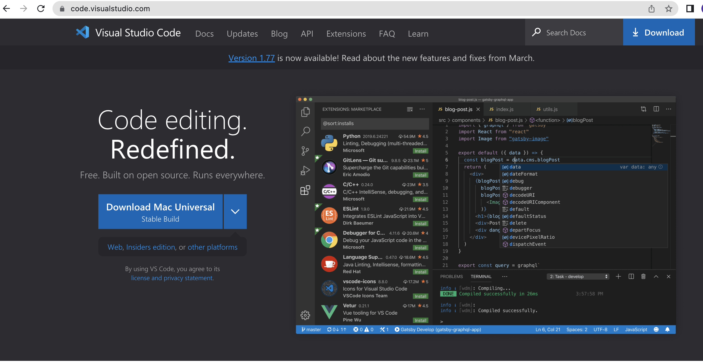
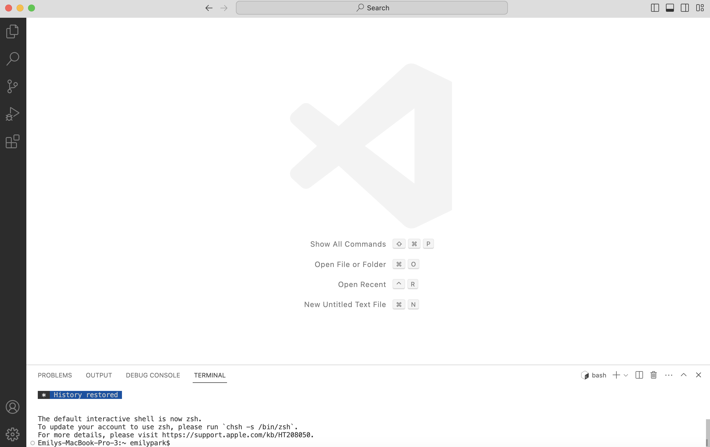
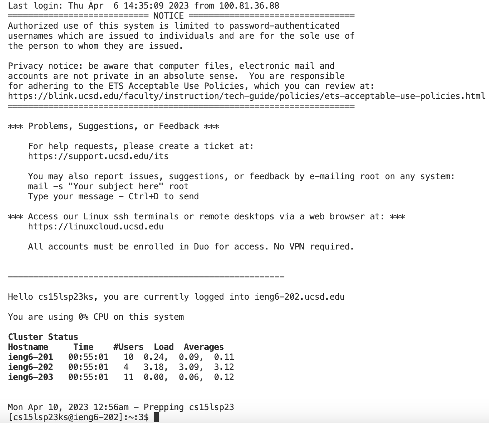

# Lab Report 1

The following tutorial is designed for future CSE 15L students. It details how to log into a course-specific account on ieng6.

## Installing VScode

Firstly, you will need to go to the Visual Studio Code website: https://code.visualstudio.com/

Make sure to download the appropriate version for your operating system. Upon the completion of the installation, you should be able to open VSCode
on your computer. Locate the menu at the top and hover your mouse over the Terminal tab, then click New Terminal.

## Remotely Connecting

Use the following link to look up your course-specific account for CSE 15L: https://sdacs.ucsd.edu/~icc/index.php
Upon logging in with your TritonLink Username and PID, you should be presented with a page with the headline "Account Lookup Results."  Locate the section titled "Additional Accounts" and click on the button containing text beginning with "cse15lsp23." Proceed to use the Global Password Change Tool(you will need your username beginning with "cse15lsp23" for this step). It may take several minutes for your password change to be completely processed.

After you've ensured that your password has successfully been reset, you will proceed to remotely connect to the server.

Note that if you're using Windows, you will need to install git for Windows using the following link: https://gitforwindows.org/

Run the following command in the terminal: ssh (username)@ieng6.ucsd.edu(replacing username with your specific username). Then enter your password.  If you are prompted with the question "Are you sure you want to continue connecting(yes/no/[fingerprint])?", type yes.

## Trying Some Commands

After connecting to the server, you can try running the following commands in the terminal:

* cd ~
* cd
* ls -lat
* ls -a
* ls (directory) where (directory) is /home/linux/ieng6/cs15lsp23/cs15lsp23abc, where the abc is one of the other group members’ username
* cp /home/linux/ieng6/cs15lsp23/public/hello.txt ~/
* cat /home/linux/ieng6/cs15lsp23/public/hello.txt

