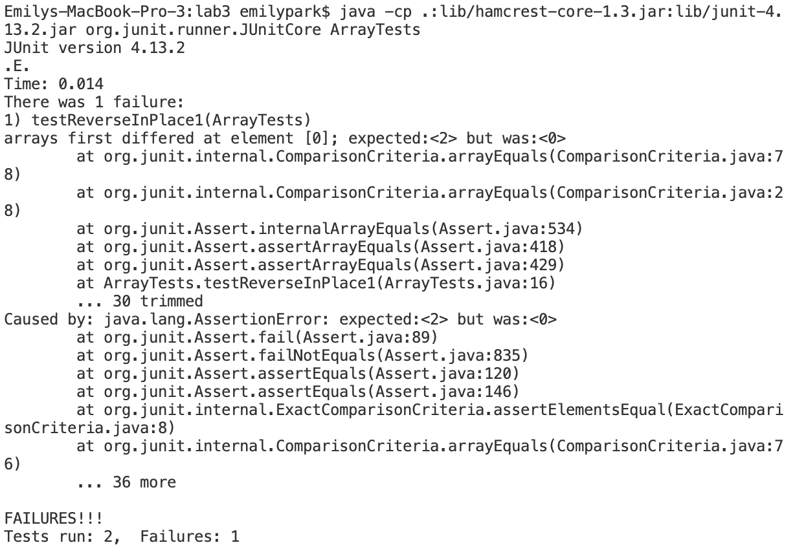

# Lab Report 2

## Part 1

* Code for `StringServer`:


* Screenshot 1:


The `handleRequest` method is being called here in order to add onto a string as a result of an incoming request. The relevant argument to this method is the url, which is `http://localhost:600/add-message?s=Hello` with `/add-message` being the path and `?s=<string>` being the query. The string `s` is a relevant field of the class `Handler` as it stores the string that is being altered. The value of `s` changed as a result of the request because the method, when executed, concatenates a new line `\n` and the value of `<string>`(which is `Hello`) to `s` as shown in lines 10-14 in the screenshot.

* Screenshot 2:


The `handleRequest` method is called once again here. The url remains a relevant argument to this method, and the string `s` remains a relevant field of the class `Handler`. The value of `s` changes as a result of the request shown in the screenshot, as a new line `\n` and the value of `<string>`(which is `World`) is concatenated to the running string of `Hello`.

## Part 2

The bug from Lab 3 that I'm choosing to focus on is the implementations of the reverse methods in ArrayExamples.java.

* Failure-inducing input for the buggy program:

```@Test
public void testReverseInPlace1() {
  int[] input2 = {7, 9, 2};
  assertArrayEquals(new int[]{2, 9, 7}, ArrayExamples.reversed(input2));
}
```
* An input that doesn't induce a failure:
```@Test
public void testReverseInPlace() {
  int[] input1 = { 0 };
  assertArrayEquals(new int[]{ 0 }, ArrayExamples.reversed(input1));
}
```

* A screenshot of the symptom:



* The bug(before the code change):

```
static int[] reversed(int[] arr) {
  int[] newArray = new int[arr.length];
  for(int i = 0; i < arr.length; i += 1) {
    arr[i] = newArray[arr.length - i - 1];
  }
  return arr;
}
```
The bug present in the code above is caused by the fact that the line `arr[i] = newArray[arr.length - i - 1];` sets all elements of `arr` to be equal to 0 since all elements in newArray are equal to 0. This causes the original values contained in `arr` to be lost and the method therefore doesn't swap the values properly. The code returns an array with elements of 0.

* Code change needed to fix the bug:

```
static int[] reversed(int[] arr) {
  int[] newArray = new int[arr.length];
  for(int i = 0; i < arr.length; i += 1) {
      newArray[i] = arr[arr.length - i - 1];
  }
  return newArray;
}
```
The code above fixes the bug by replacing `arr[i]` with `newArray[i]` and `arr[arr.length - i - 1];` with `newArray[arr.length - i - 1];` and also by returning `newArray` instead of `arr`. This allows the array to be properly swapped using the original values contained in `arr` rather than the newly created array with values of 0.

## Part 3

Something I learned from lab in week 2 that I didn't know before is how to build and run a web server. I learned how to write a web server in VSCode that handles a path and a query, and how to use terminal commands to create and run the server on my local computer.
