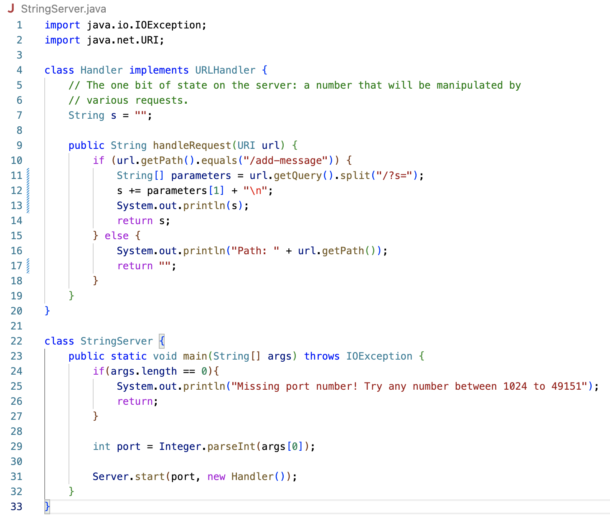
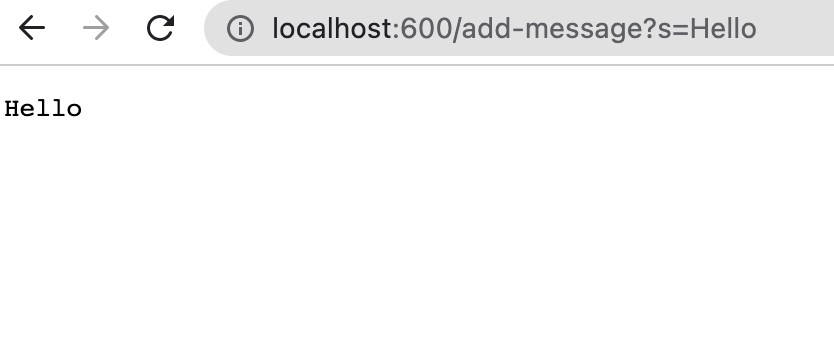
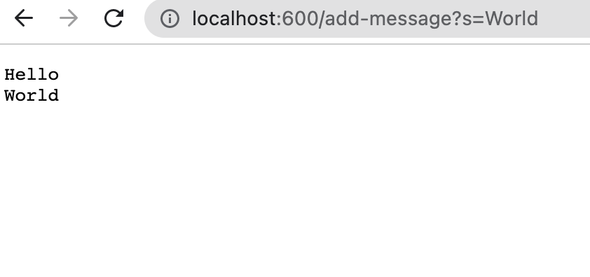

# Lab Report 2

## Part 1

* Code for `StringServer`:



* Screenshot 1:



The `handleRequest` method is being called here in order to add onto a string as a result of an incoming request. The relevant argument to this method is the url, which is `http://localhost:600/add-message?s=Hello` with `/add-message` being the path and `?s=<string>` being the query. The string `s` is a relevant field of the class `Handler` as it stores the string that is being altered. The value of `s` changed as a result of the request because the method, when executed, concatenates a new line `\n` and the value of `<string>`(which is `Hello`) to `s` as shown in lines 10-14 in the screenshot.

* Screenshot 2:



The `handleRequest` method is called once again here. The url remains a relevant argument to this method, and the string `s` remains a relevant field of the class `Handler`. The value of `s` changes as a result of the request shown in the screenshot, as a new line `\n` and the value of `<string>`(which is `World`) is concatenated to the running string of `Hello`.

## Part 2

The bug from Lab 3 that I'm choosing to focus on is the implementations of the reverse methods in ArrayExamples.java.

* Failure-inducing input for the buggy program:

```@Test
<br>public void testReverseInPlace1() {
  <br>int[] input2 = {7, 9, 2};
  <br>assertArrayEquals(new int[]{2, 9, 7}, ArrayExamples.reversed(input2));
<br>}```
