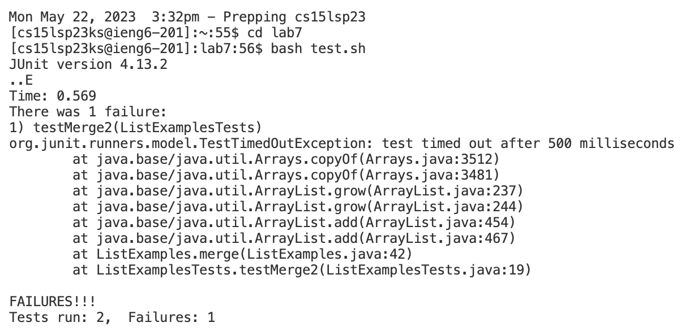
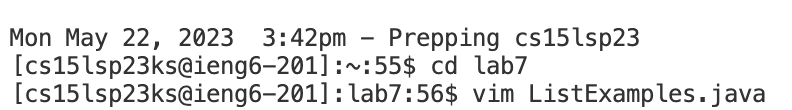
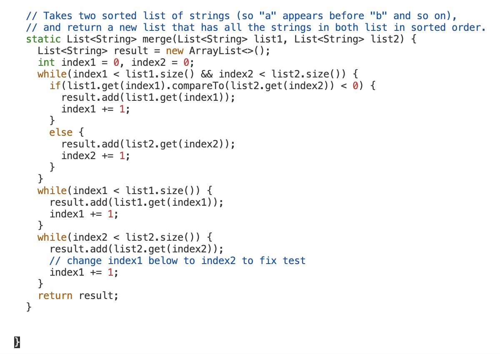
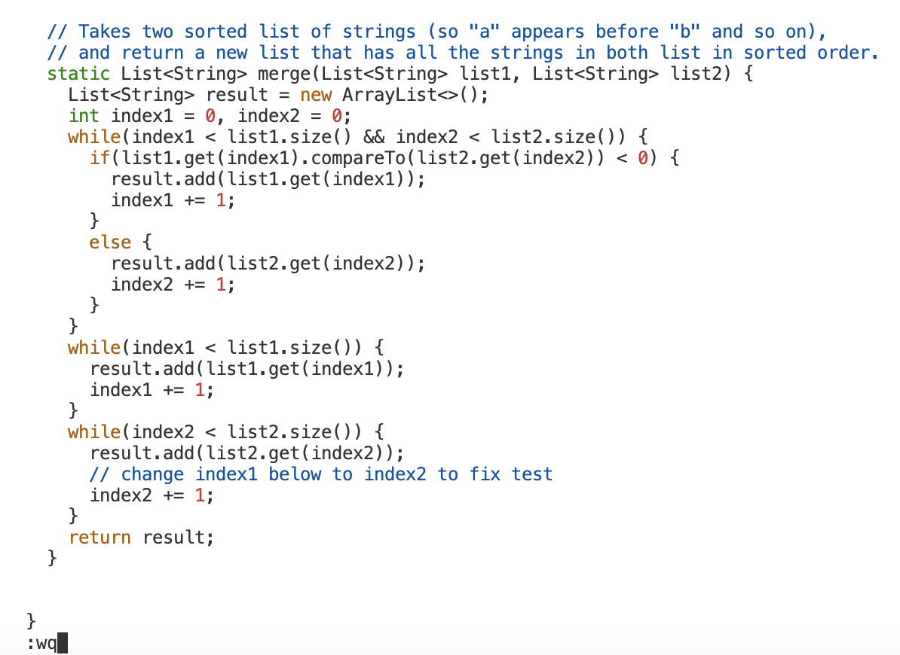
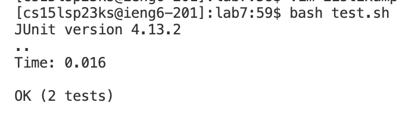
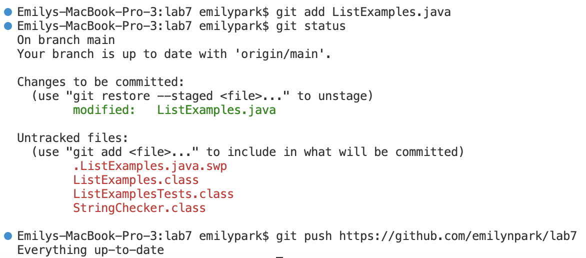
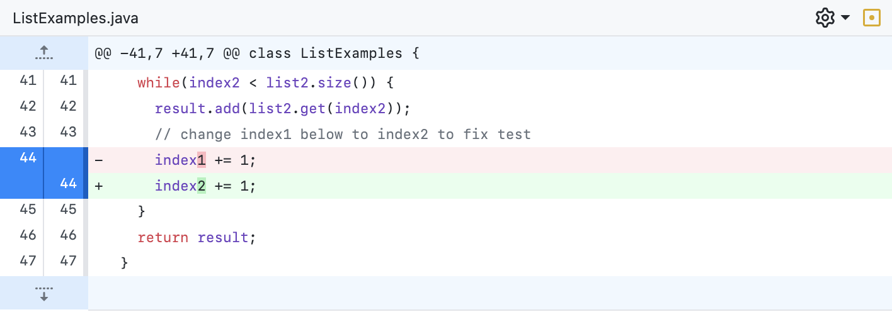

# Lab Report 4

## Step 4

 To get to this step, I started a new terminal and typed in the command `ssh cs15lsp23ks@ieng6.ucsd.edu` to login to my CSE 15L account. I pressed `<enter>` to run the command. 

## Step 5

 To get to this step, I typed the command `git clone https://github.com/ucsd-cse15l-s23/lab7` in the terminal. I pressed `<enter>` to run the command. 

 To demonstrate that the tests contained in `ListExamples.java` fail, I typed the command `bash test.sh` in the terminal. I pressed `<enter>` to run the command. 

 To edit the code file `ListExamples.java` to fix the error, I first ran the command `cd lab7` to change the working directory to `lab7`. I then typed in `vim ListExamples.java` to directly edit the file. 

