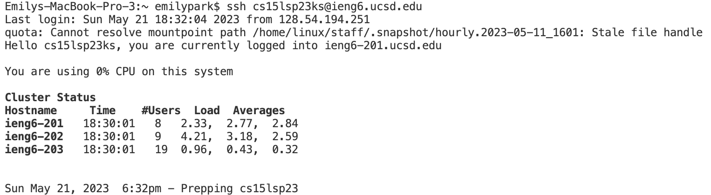

# Lab Report 4

## Step 4

To get to this step, I started a new terminal and typed in the command `ssh cs15lsp23ks@ieng6.ucsd.edu` to login to my CSE 15L account. I pressed `<enter>` to run the command.

## Step 5

To get to this step, I typed the command `git clone git@github.com:emilynpark/lab7.git` in the terminal. I pressed `<enter>` to run the command.

## Step 6

To demonstrate that the tests contained in `ListExamples.java` fail, I typed the command `bash test.sh` in the terminal. I pressed `<enter>` to run the command.

## Step 7

To edit the code file `ListExamples.java` to fix the error, I first ran the command `cd lab7` to change the working directory to `lab7`. I then typed in `vim ListExamples.java` to directly edit the file.

I was presented with the code above after running the command `vim ListExamples.java`. The screenshot and details below show the keys that I pressed to fix the error.

I first pressed the up arrow/`k` to reach the line containing the error.  I then pressed the right arrow/`l` until my cursor was over the `1` in `index1`, and I pressed `x` to delete the `1`. I proceeded to press `i` to enter the insert mode, and pressed `2` so that the line now contains `index2`. I pressed `<esc>` to exit the insert mode, and then I pressed `:wq` followed by `<enter>` to save my changes.

## Step 8

I returned to the terminal and I ran the command `bash test.sh` to demonstrate that the error has been fixed and the tests now succeed.

## Step 9

I ran the command `git add ListExamples.java` to stage the file in order to commit it to GitHub. To confirm that my changes have been appropriately saved, I ran the command `git status`. I then ran the command `git push https://github.com/emilynpark/lab7` to push the changes to my GitHub account.

The resulting changes have been successfully saved to my GitHub account.
