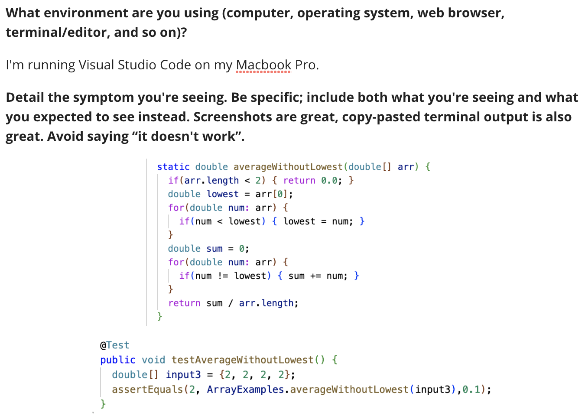
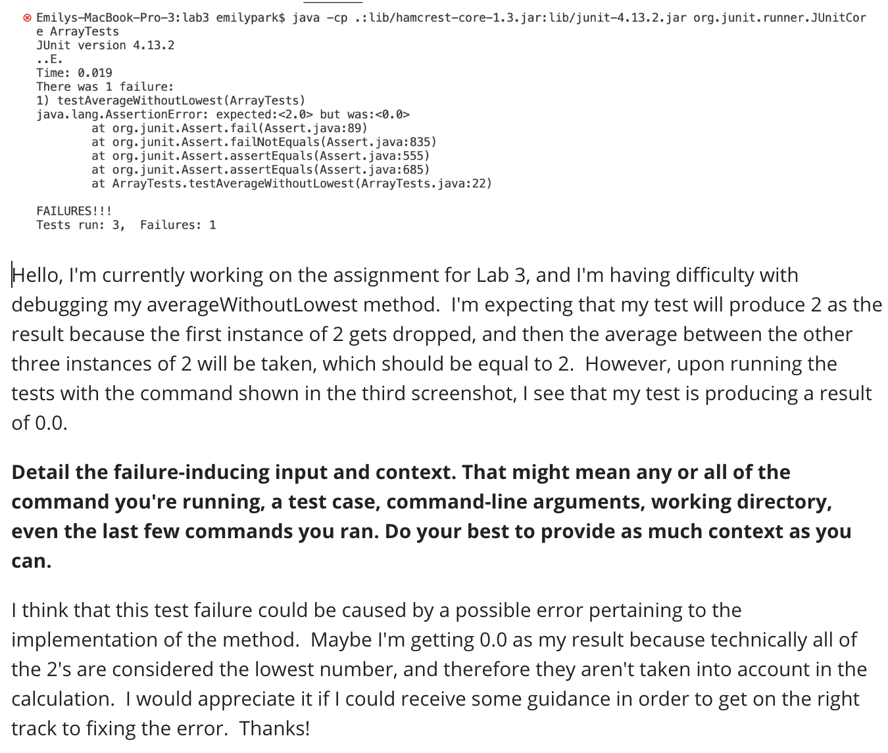
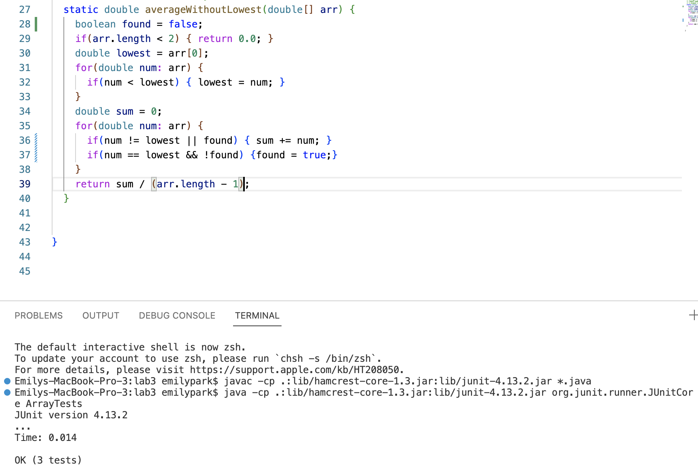

# Lab Report 5

## Part 1

### Debugging Scenario
Screenshots of Student's Debugging Problem:

### Response from TA:
 You have the right idea that there is an error in the logic behind your implementation. You will need to implement a way to identify the first instance of the lowest element in order for your tests to run as expected. One way in which you can achieve this is by initializing a boolean variable with the name `found` and initially setting it to false, and then in your second for loop you can implement code to check whether or not the lowest number in the array has been located. If the current `num` that is being checked by the for loop isn't equal to the lowest number, or if the lowest number has already been found(if the value of `found` is equal to true at this point), then the lowest number gets added to the total sum. If the current `num` that is being checked by the for loop is equal to the lowest number, and if the lowest element hasn't yet been located(if the value of `found` is equal to false at this point), then `found` should be set to true. 
 Additionally, there is an error behind the logic in the division in your return statement. `arr.length` gives us the length of the entire array. The occurrence of the lowest number shouldn't be included as part of the calculation. Therefore, you need to revise the divisor of the return statement(hint: you should subtract a certain number from arr.length; refer to the explanation in the previous sentences to figure out the correct number to subtract). 

### Response from Student:
 After trying out your suggestions, I was able to get my test working! I now understand that the initial bugs were caused by me not identifying the first instance of the lowest number within the array, and by me not deducting 1 from `arr.length` to account for the fact that the lowest number in the array isn't included in the calculation. 

### Scenario Setup Information
 File and directory structure needed: https://github.com/ucsd-cse15l-w23/lab3 
 Contents of the file prior to fixing the bug: 

 Command lines I ran to trigger the bug: `javac -cp .:lib/hamcrest-core-1.3.jar:lib/junit-4.13.2.jar *.java` and `java -cp .:lib/hamcrest-core-1.3.jar:lib/junit-4.13.2.jar org.junit.runner.JUnitCore ArrayTests` 
 What to edit to fix the bug: First, initialize a variable named `found` of type `boolean`, and set it to be false. Next, within the second for loop, change the existing `if` statement from `if(num != lowest)` to `if(num != lowest || found)`, and then create a second if statement as follows: `if(num == lowest && !found) {found == true;}`. Lastly, modify the return statement to `return sum / (arr.length - 1)`. 

## Part 2
Something I learned in lab during the second half of the quarter is how to use various Vim commands. Specifically, I learned to use `x` to delete a character, `i` to insert a character(and then `esc` to exit insert mode), and `:wq` to write and quit a file.
